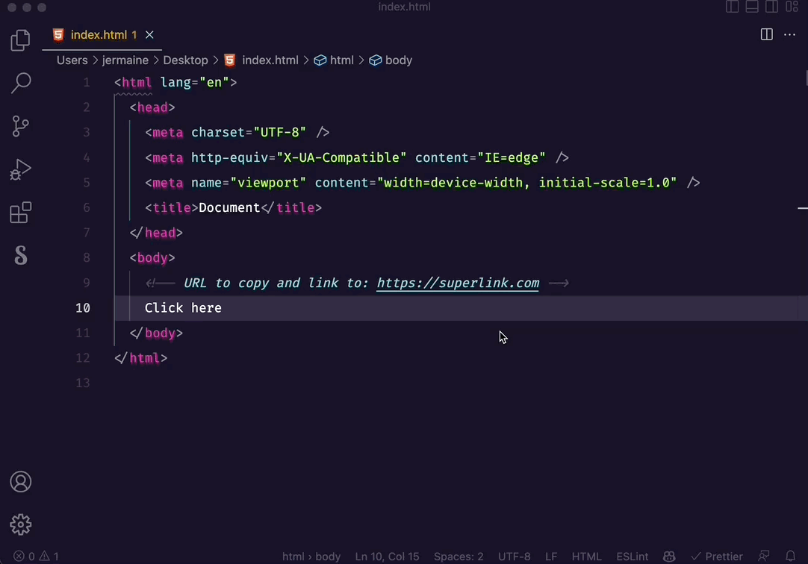

# Superlink

Superlink is a VS Code extension that allows you to quickly create hyperlinks in HTML code.

## How to use it

1. Copy a URL to your clipboard
2. Select some text in your HTML document
3. `CMD+L` (Mac) / `CTRL+L` (Win) or run the command `superlink.createHyperLink
4. The selected text will be replaced with a hyperlink using the copied URL

## Contributing

If you find any issues or have any suggestions for improvements, please open an issue or a pull request on the [GitHub repository](https://github.com/jermaine-craig/superlink).

## Author

[Jermaine Craig](https://jermainecraig.com)
